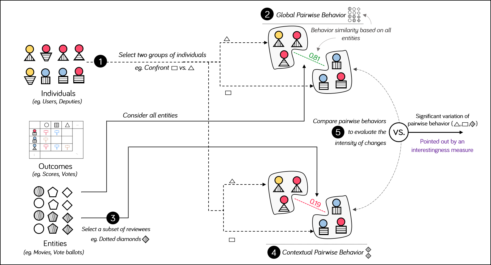

# DEBuNk
This repository contains the materials concerning the paper in review: A Generic Framework For Behavioral Data Analysis. It contains:
1. **DSC_Project**: includes all the scripts of the framework.
2. **Experiments**: all experiments depicting the quantitative and qualitative ```DEBuNk``` as well as the set of scripts used to generate the experiments.

Below we give the method overview. Note that ```DEBuNk``` stands for Discovering Exceptional Behavior patterNs.

>The method depicted in the figure above describe a generic framework which enables discovering exceptional pairwise behavior patterns by finding groups of individuals that unexpectedly behave under a specific context. The method considers any data describing individuals who give outcomes (actions, opinion) over a collection of entities (Berhavioral Data, examples cover Ratings data, voting data, monitoring data ...).  ```DEBuNk``` returns a collection of patterns of the form (c,u1,u2) which depict two confronted groups of individuals (u1,u2) for which we observe an exceptional change of pairwise behavior (inter-agreement) under the context (c) describing a subset of entities, this compared to the usual pairwise behavior observed over the whole set of entities. In a nutshell, ```DEBuNk``` starts by forming groups of individuals ___(1)___ by enumerating conditions/restrictions on the description attributes of individuals. Next, it computes the global pairiwse behavior model which describe the usual pairwise behavior between the two groups ___(2)___. Subsequently, subsets of entities are formed by enumerating conditions/restrictions (contexts) on the descriptive attributes of entities ___(3)___. The yielded subset of entities  is used to compute a contextual pairwise behavior model ___(4)___ which is eventually compared ___(5)___ to the global one. If an "important" deviation is observed (exceeds some user-defined threshold) than the pattern is considered in the results set.

### Qualitative experiments 
In order to launch the algorithm ```DEBuNk``` to read a behavioral dataset and returns a set of relevant behavior patterns, a configuration file need to be specified to the method which structure is given below:  

```
{
	"objects_file":<entities collection file path>,
	"individuals_file":<individuals collection file path>,
	"reviews_file":<outcomes collection file path>,
	"delimiter":<delimiter used in the input csv file> (e.g. "\t"),

	"nb_objects":<number of entities to consider> (e.g.5000),
	"nb_individuals":<number of individuals to consider> (e.g.5000),

	"arrayHeader":<the set of attributes which values are of the form of an array (usually HMT attributes> (e.g. ["PROCEDURE_SUBJECT"]),
	"numericHeader":<the set of attributes which values are numerical (e.g. ["VOTE_DATE","EU_MEMBER_SINCE"]),
	"vector_of_outcome":<the structure of the outcomes vector> (e.g. if null all the attributes in the outcomes file are considered as elements depicting the action of an individual over an entity),
	"description_attributes_objects":<the descriptive attributes to consider for entities>, (e.g.[["PROCEDURE_SUBJECT", "themes"],["VOTE_DATE","numeric"],["COMMITTEE","simple"]]),
	"description_attributes_individuals":<the descriptive attributes to consider for individuals>, (e.g.[["EU_MEMBER_SINCE", "numeric"],["CURRENCY", "simple"],["SCHENGEN_MEMBER", "simple"],["COUNTRY", "simple"],["GROUPE_ID", "simple"],["NATIONAL_PARTY", "simple"]])

	"threshold_objects":<the minimum entities support size threshold> (e.g. 40),
	"threshold_individuals":<the minimum individuals support size threshold> (e.g. 10),
	"threshold_quality":<the minimum quality threshold> (e.g. 0.5),
	

	"aggregation_measure":<the used outcome aggregation operator>,
	"similarity_measure":<the used similarity measure>,
	"quality_measure":<the used quality/interestingness measure>,
	"algorithm":<the algorithm used> (e.g. 'DSC+SamplingPeers+RandomWalk' for QuickDebunk),
	"timebudget":<maximum time budget given to the execution of the algorithm, relevant parameter if the algorithm choosed is QuickDebunk> ,

	"results_destination":<yielded patterns results file path"> (e.g. .//results.csv")
}

```

Several examples are given in Experiments directory containing four configuration files corresponding to the four considered datasets (European Parliament Dataset, Yelp, Movielens and Openmedic). To run others experiments using this datasets, we advise you to copy one of the configuration file and replace the parameter values with the desired inputs. Note that, this companion page will be continuously updated to provide an easy way to specify and run an input configuration file. 

Once the configuration file is defined it can be executed using the command below.

```
python .//DSC_Project//main.py <configuration file path> -q <results set path>
```

Other options are available which enable the modification of the parameters specified in the configuration file. All these elements are specified in the documentation of the main script. For more information about the available options please run:

```
python .//DSC_Project//main.py -h
```

The script allows also to launch performance experiments, examples of such commands for each benchmark dataset are given in the experiments directory. 

